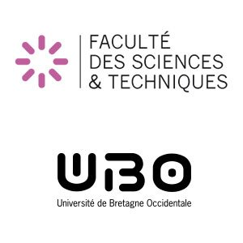

# Rapport de Stage - Master 1 Informatique - PASTE Théo

<figure><figcaption></figcaption></figure>

 

<figure><figcaption></figcaption></figure>

### Introduction

Afin de valider ma première année d'étude en Master Informatique à l'Université de Bretagne Occidentale, j'ai effectué un Stage en entreprise de 5 mois, du 27 Mars 2022 au 27 Août 2023, à Sopra Steria.

Située à Brest, c'est l'équipe de développement N-Tiers qui m'a accueillie dans leurs locaux pour ce stage.


[sopra-steria.md](sopra-steria.md)


### Mon Environnement de Travail


[les-logiciels.md](mon-environnement-de-travail/les-logiciels.md)



[larchitecture.md](mon-environnement-de-travail/larchitecture.md)


### Ma Mission


[automatisation-google-sheet.md](ma-mission/automatisation-google-sheet.md)



[les-tickets.md](ma-mission/les-tickets.md)


### Conclusion


[apres-10-semaines-de-stage.md](conclusion/apres-10-semaines-de-stage.md)

