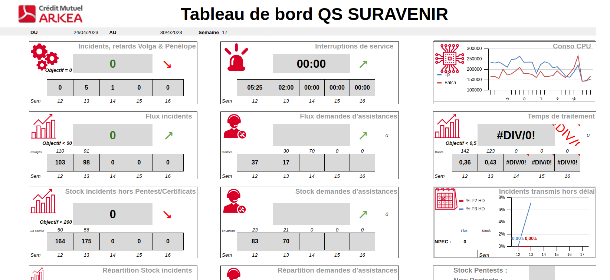
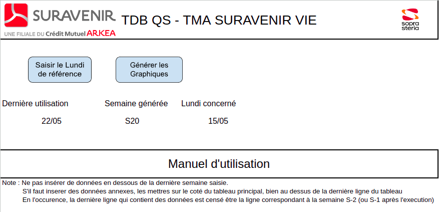
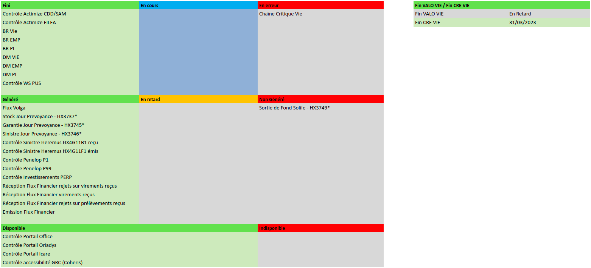
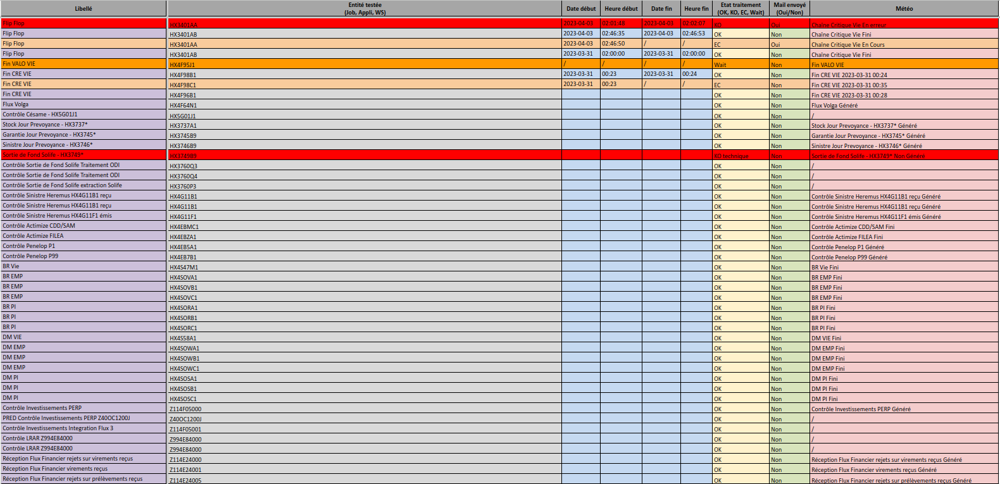

# Automatisation Google Sheet

Une partie du stage consistait à développer des scripts dans des Google Sheets afin d'automatiser certaines tâches redondantes.

### Tableau de Bord QS SURAVENIR

Il s'agit d'un tableau permettant le suivi du flux de chaque semaine. Ce tableau de bord est alimenté avec les données datant de la semaine précédente. Chaque début de semaine commence donc avec le remplissage de ce document, et donc l'ajout de nouvelles lignes pour contenir ces nouvelles données. L'objectif ici était donc d'automatiser cet ajout de ligne afin de de simplifier la modification du document, ainsi que de mettre à jour les différents graphiques présent dedans.

<figure><figcaption>
Tableau de bord
</figcaption></figure>

Lors de l’exécution du script, une pop-up s'ouvre et demande à l'utilisateur de saisir la date du lundi de la semaine à ajouter. Si la saisie n'est pas une date, un message d'erreur est affiché et le script ce termine. Dans le cas contraire, la date est insérée dans la page de garde, pour avoir un suivi, ainsi que la page principale `TBD QS 2023` pour le traitement et le calcul du numéro de semaine. Celui-ci est sauvegardé pour les besoins du script et le script navigue dans les différentes pages en faisant les ajouts et modifications nécessaires.

<figure><figcaption>
Page de garde du Tableau de Bord
</figcaption></figure>

La génération des graphique se contente simplement de recréer les graphiques des différentes pages avec les données présentes.&#x20;

### La Météo

La météo s'effectue tout les matins, et consiste à tester, vérifier, les différents processus qui se sont exécuté depuis la veille. Une fois ces vérifications faites, un tableau est créé/modifié, puis envoyé au client, afin de le tenir informer quant à l'état des différent processus. La première partie de l'automatisation, dont je ne m'occupe pas, consiste à ne plus faire les vérifications des processus manuellement. Avec UIPath et un ficher excel d'entrée, un fichier excel est généré et contient les status de tout les Jobs des différentes Chaines testées.

Ma mission ici était d'automatiser la génération du tableau de la Météo du matin présent en bas de la page Confluence `Contrôle du matin - Météo TMA`, à partir de ce fichier résultat. Un fichier Google Sheet a donc été créé, contenant le tableau final sur la première page et le script pour le remplir. Une fois celui-ci terminé, un PDF contenant le tableau remplie est généré.

<figure><figcaption>
Tableau de la Météo du Matin
</figcaption></figure>

Lors de l’exécution du script, le Google Sheet `Tableau_Météo_du_matin_V1` est mis à jour grâce au fichier `Résultat_Controle_du_matin`. Comme nous souhaitons conserver une trace des différentes météos, un dossier `Archives` contiendra les différents fichiers `Résultat_Controle_du_matin` ainsi qu'un PDF du tableau final issu de `Tableau_Météo_du_Matin`.

<figure><figcaption>
Exemple de fichier résultat
</figcaption></figure>

A l'heure actuelle, la partie UIPath est toujours en développement.&#x20;
