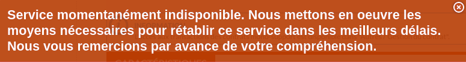

# Les Tickets

Durant l'autre partie du stage, j'ai du apprendre à prendre en charge des tickets. Ici, ont en distingue 3 types:

* Les DIT MC
* Les DIT AS
* Les Incidents

### Incident

Les incidents sont des dysfonctionnement entraînant l'interruption ou la dégradation d'un service. Il peut s'agir d'une erreur remonté par un utilisateur ou d'un certificat qui sera bientôt expiré par exemple.

### Demande d'Intervention Technique à une TMA, de type Assistance/Support (DIT AS)

Ces demandes indiquent que le problème ne bloque pas l'utilisation de l'application. Ce type de ticket peut faire référence à des documents qui n'apparaissent pas sur le site par exemple.

### Demande d'Intervention Technique à une TMA, de type Maintenance Corrective (DIT MC)

Ces demandes indiquent que le problème doit être résolue via du développement. Une fonctionnalité indisponible, une évolution ou encore des tickets fréquent de cause similaire peuvent en être la source.

## Les différentes catégories de tickets

### Recherche de logs

Dans la grande majorité des cas, la résolution d'un ticket passe avant tout par une recherche dans les logs, afin de trouver l'erreur qui a provoqué la création du ticket.&#x20;

Il existe 2 moyens d'accéder aux logs: les Minisites et Kibana

Il existe un Minisites par processus (ex: Souscription, Arbitrage, Consultation, etc...), et possèdent les logs des derniers jours (moins d'une semaine).

**Kibana** est une extension de visualisation de données pour Elasticsearch (un logiciel pour l'indexation et la recherche de données). Ici, il permet la recherche de logs sur une plus longue durée, environ 2 semaines.&#x20;

Au delà de 2 semaines, les logs ne sont plus disponible.

La recherche et la découverte de l'erreur dans les logs permet généralement la déduction du problème, et de remonter celui-ci à la source.&#x20;

### Les reconstitution de flux

Il arrive qu'il soit nécessaire de rejouer des requêtes SOAP, afin de re-générer des documents ou de réexécuter des requêtes qui n'aurait pas abouti.

SOAP (ancien acronyme de _Simple Object Access Protocol_) est un protocole d'échange d'information structurée dans l'implémentation de services web bâti sur XML.

Le protocole SOAP est composé de deux parties :

* une enveloppe, contenant des informations sur le message lui-même afin de permettre son acheminement et son traitement ;
* un modèle de données, définissant le format du message, c'est-à-dire les informations à transmettre.

### Purge de rejet

Certains incidents vont générer des messages en rejet qui vont être stockés dans des Queues. Lorsque la médiation reçois un message et génère une erreur, celui-ci est remis dans la queue des messages et est rejoué. Il sera rejoué tant qu'il sera remis dans la queue. La purge de rejet consiste donc à supprimer le message en vérifiant au préalable la raison pour laquelle le rejet a été généré.

### Les Certificats

Les certificats SSL permettent aux sites web de passer de HTTP à HTTPS, ce qui est plus sécurisé. Un certificats SSL est un fichier de données hébergé dans le serveur d'origine d'un site Web. Les certificats SSL rendent le chiffrement SSL/TLS possible. Ils contiennent la clé publique du site, l'identité du site web ainsi que des informations connexes. Les appareils qui tentent de communiquer avec le serveur référencerons ce fichier pour obtenir la clé publique et vérifier l'identité du serveur. La clé privé est gardée secrète et sécurisée.

SSL (Secure Socket Layer), plus communément appelé TLS (Transport Layer Security) est un protocole de chiffrement du trafic Internet et de vérification de l'identité des serveurs. Tout site Web avec une adresse web HTTPS utilise SSL/TLS.

Un certificat SSL contient les informations suivantes:

* Un émetteur, qui indique quel Autorité de Certification a émis le certificats.
* L'identité dont le certificats apporte la preuve (un nom de domaine, une personne, une organisation, une machine, etc... pour lequel le certificat a été délivré)
* Une signature numérique de l'Autorité de Certification qui a émis le certificat
* Les dates de validité (émission / expiration)
* La clé publique du certificat

2 points à noter:

* le contenu d'un certificat est public, il n'y a rien à protéger.
* La clé privée prouve que le certificat nous appartient. Le couple {clé privé + certificat} correspond à une pièce d'identité, mais au format numérique. Perdre la clé privée revient à perdre sa pièce d'identité.

Les extensions de fichiers:

* Les Certificate Signing Request (CSR) sont des ".csr"
* Les certificats sont généralement des ".crt"
* Les clé privé ".key"
* L'ensemble {certificat + clé privée}, qui sont normalement protégés par un mot de passe, sont des ".p12" (pour Linux)

Certificats Internes / Certificats Externes

* Les certificats internes : pour les sites privé, qui ne seront contactés que par des membres internes du Crédit mutuel Arkéa (CMA).
* Les certificats externes : pour les sites publiques, qui doivent être contactés par tous à travers le monde.

Les certificats traités dans notre cas sont essentiellement (voir exclusivement) des certificats client-interne. Ces certificats sont utilisés pour identifier un client ou un utilisateur, par son authentification auprès du serveur qui établit précisément qui il est.

Le renouvellement des certificats nécessite certaines procédures, qui peuvent changer d'un projet à l'autre. Il existe une page Confluence par certificats sous notre responsabilité. De cette manière, nous possédons à la fois un suivi sur l'état du renouvellement du certificat, mais aussi et surtout la procédure à effectuer pour renouveler ce certificat.

### DIT MC

Une DIT MC qui m'a été affecté consiste a modifier un libellé d'erreur.

Certains type de contrat ne peuvent être imprimé. Ainsi lorsque l'utilisateur tente d'imprimer / télécharger le PDF de son contrat, une erreur générique est affiché:

<figure><figcaption></figcaption></figure>

L'objectif était donc de modifier ce message afin de le rendre plus explicite, pour les contrats qui remonteraient cette erreur.
