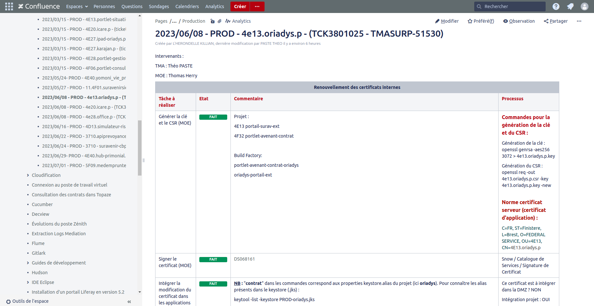

# Les Logiciels

### Confluence

Développé par l'éditeur de logiciel Australien Atlassian en 2004, Confluence est un logiciel de wiki, utilisé comme logiciel de travail collaboratif.

#### Travail de rédaction

Durant ce stage, j'ai été amené à rédiger des pages de documentation, autant pour avoir un suivi que pour détailler des procédures. Confluence est un logiciel de wiki, de travail collaboratif, et c'est ce qui est utilisé pour documenter des sujets. Les rédactions en question concernait les scripts Google Sheets, qui sont uun suivi de l'avancement, des raisonnements et des évolutions, ainsi que des pages Confluence pour les demandes de droits (BDD Access, VMWARE, Confluences, Snow, Jira, etc...) et renouvellement de certificats.

<figure><figcaption>
Une page Confluence de certificat
</figcaption></figure>

### Jira

Jira est un système de de suivi de bugs et de gestion des incidents développé par Atlassian en 2002

### Eclipse / IntelliJ

Les développement se fond majoritairement via Eclipse, mais passerons progressivement sur IntelliJ.

### Git / SVN

Subversion (ou SVN) est un logiciel de gestion de versions, distribué sous licence Apache3 et développé par Apache Software Fundation.

Subversion fonctionne sur le modèle client-serveur, avec :&#x20;

* un serveur centralisé et unique où se situent :
  * les fichiers constituant la référence (le "dépôt" ou "référenciel", "repository" en anglais),
  * un logiciel serveur Subversion tournant en tâche de fond;
* des postes clients sur lesquels se trouvent :&#x20;
  * les fichiers recopiés depuis le serveur, éventuellement modifiés localement depuis leur récupération,
  * un logiciel client, sous forme d'exécutable standalone (comme SmartSVN par exemple) ou de plug-in (Eclipse Subversive dans notre cas) permettant la synchroniqation, manuelle et/ou automatisée, entre chaque client et le serveur de référence.

Git est un logiciel de gestion de versions décentralisé. C'est un logiciel libre et gratuit, créé en 2005 par Linus Torvalds, auteur du noyau Linux.

Depuis les années 2010, il s'agit du logiciel de gestion de versions le plus populaire dans le développement logiciel et web, qui est utilisé qur touts les environnements : Windws, Linux et Mac. Git est aussi le système à la base du site web GitHub, le plus important hébergeur de code informatique.

Les projets sont majoritairement sous SVN, mais migre progressivement vers Git.
