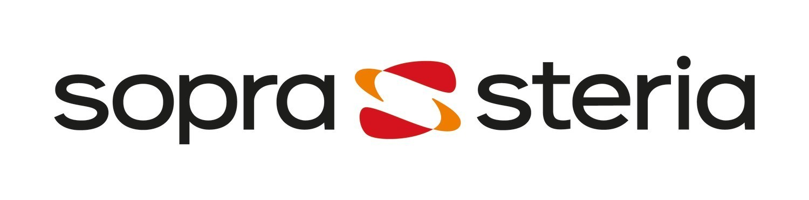

# Sopra Steria

<figure><figcaption></figcaption></figure>

### Qui sont-ils ?

Sopra Steria est un Entreprise de Service Numérique (ESN) et une société de conseil en transformation numérique créé en 2015 par la fusion de Sopra, entreprise de conseil, de services technologique et d'édition de logiciels fondé en 1968, et de Steria, une Société de Service en Ingénierie Informatique (SSII) fondé en 1969.

Le site a pour client une filiale du Crédit Mutuel Arkea, Suravenir, depuis 2021.

Si le secteur d'activité de ce site est l'Assurance, Sopra Steria est également actif dans les domaines de l'Aéronautique et spatial, Défense et Sécurité, Services financiers, Gouvernement, Télécommunication, Médias et Divertissement, Transport ainsi que l'Énergie.
